# Codebase Architecture Documentation

## Overview

This repository consists of a collection of Python-based solutions for various **Data Structures & Algorithms** problems. Each problem resides within its own directory under `Data Structures & Algorithms/` and contains one or more submission files (`submission-X.py`).

The codebase follows a highly centralized dependency pattern where `Data Structures & Algorithms/surrounded-regions/submission-1.py` acts as a common base dependency across almost all problem submission files, while a small set of specialized data structure files remain entirely independent.

---

## Component Architecture & Module Structure

The codebase is organized into four main operational categories:

### 1. Central Core Dependency
* **`Data Structures & Algorithms/surrounded-regions/submission-1.py`**
  * **Entity:** `Solution`
  * **Dependencies:** None (`[]`)
  * **Role:** Serves as the central dependency referenced by the vast majority of problem submission modules across the codebase.

### 2. Standalone Structural Components
These modules operate independently without external codebase dependencies (`depends_on: []`):

* **`Data Structures & Algorithms/minimum-stack/submission-0.py`**
  * **Entity:** `MinStack`
* **`Data Structures & Algorithms/kth-largest-integer-in-a-stream/submission-0.py`**
  * **Entity:** `KthLargest`
* **`Data Structures & Algorithms/serialize-and-deserialize-binary-tree/submission-0.py`**
  * **Entity:** `Codec`

### 3. Dependent Solution Modules
All remaining problem submission modules instantiate or extend the `Solution` entity and depend directly on `Data Structures & Algorithms/surrounded-regions/submission-1.py`.

The problem categories defined in the repository include:

* **Arrays, Hashing & Matrices:** `two-integer-sum`, `two-integer-sum-ii`, `three-integer-sum`, `products-of-array-discluding-self`, `longest-consecutive-sequence`, `valid-sudoku`, `is-anagram`, `anagram-groups`, `duplicate-integer`, `find-duplicate-integer`, `top-k-elements-in-list`
* **Strings & Sliding Window:** `string-encode-and-decode`, `longest-substring-without-duplicates`, `longest-repeating-substring-with-replacement`, `permutation-string`, `is-palindrome`
* **Two Pointers & Stack:** `max-water-container`, `trapping-rain-water`, `validate-parentheses`, `evaluate-reverse-polish-notation`, `daily-temperatures`, `car-fleet`, `largest-rectangle-in-histogram`
* **Linked Lists:** `reverse-a-linked-list`, `merge-two-sorted-linked-lists`, `merge-k-sorted-linked-lists`, `reorder-linked-list`, `remove-node-from-end-of-linked-list`, `add-two-numbers`, `linked-list-cycle-detection`, `reverse-nodes-in-k-group`
* **Binary Trees & BSTs:** `invert-a-binary-tree`, `depth-of-binary-tree`, `binary-tree-diameter`, `balanced-binary-tree`, `same-binary-tree`, `subtree-of-a-binary-tree`, `lowest-common-ancestor-in-binary-search-tree`, `level-order-traversal-of-binary-tree`, `binary-tree-right-side-view`, `count-good-nodes-in-binary-tree`, `valid-binary-search-tree`, `kth-smallest-integer-in-bst`, `binary-tree-from-preorder-and-inorder-traversal`
* **Binary Search:** `binary-search`, `search-2d-matrix`, `eating-bananas`, `find-minimum-in-rotated-sorted-array`, `find-target-in-rotated-sorted-array`
* **Heap / Priority Queue:** `k-closest-points-to-origin`, `kth-largest-element-in-an-array`, `last-stone-weight`
* **Graphs:** `count-number-of-islands`, `max-area-of-island`, `clone-graph`, `islands-and-treasure`, `rotting-fruit`, `pacific-atlantic-water-flow`, `course-schedule`, `course-schedule-ii`, `redundant-connection`, `count-connected-components`, `valid-tree`, `word-ladder`, `network-delay-time`
* **Dynamic Programming & Backtracking:** `subsets`, `climbing-stairs`, `min-cost-climbing-stairs`, `house-robber`, `house-robber-ii`, `longest-palindromic-substring`, `palindromic-substrings`, `coin-change`, `coin-change-ii`, `target-sum`, `partition-equal-subset-sum`, `longest-common-subsequence`, `edit-distance`, `interleaving-string`, `buy-and-sell-crypto`, `buy-and-sell-crypto-with-cooldown`, `unique-paths-ii`, `minimum-path-sum`, `count-paths`, `n-th-tribonacci-number`

---

## Class Entities

| Entity Class Name | Location Files | Primary Responsibility / Function |
| :--- | :--- | :--- |
| `Solution` | Most `submission-X.py` files & `surrounded-regions/submission-1.py` | Implements core algorithms and problem-solving logic. |
| `MinStack` | `minimum-stack/submission-0.py` | Stack structure supporting minimum element retrieval. |
| `KthLargest` | `kth-largest-integer-in-a-stream/submission-0.py` | Data structure tracking the k-th largest element in a stream. |
| `Codec` | `serialize-and-deserialize-binary-tree/submission-0.py` | Handles serialization and deserialization of binary tree structures. |

---

## Architectural Dependency Diagram

```mermaid
graph TD
    %% Core Shared Dependency
    subgraph SharedCore [Shared Core Module]
        SurroundedRegions["surrounded-regions/submission-1.py<br/>(Entity: Solution)"]
    end

    %% Standalone Modules
    subgraph StandaloneModules [Standalone Utilities]
        MinStackModule["minimum-stack/submission-0.py<br/>(Entity: MinStack)"]
        KthLargestModule["kth-largest-integer-in-a-stream/submission-0.py<br/>(Entity: KthLargest)"]
        CodecModule["serialize-and-deserialize-binary-tree/submission-0.py<br/>(Entity: Codec)"]
    end

    %% Representative Dependent Solution Groups
    subgraph GraphSolutions [Graph & Matrix Algorithms]
        CloneGraph["clone-graph/submission-0.py"]
        CountIslands["count-number-of-islands/submission-0.py"]
        CourseSchedule["course-schedule/submission-1.py"]
        PacificAtlantic["pacific-atlantic-water-flow/submission-0.py"]
    end

    subgraph TreeSolutions [Tree Algorithms]
        InvertTree["invert-a-binary-tree/submission-0.py"]
        TreeDepth["depth-of-binary-tree/submission-0.py"]
        BSTValidate["valid-binary-search-tree/submission-2.py"]
    end

    subgraph ListSolutions [Linked List Algorithms]
        ReverseList["reverse-a-linked-list/submission-0.py"]
        MergeLists["merge-two-sorted-linked-lists/submission-0.py"]
        LinkedListCycle["linked-list-cycle-detection/submission-0.py"]
    end

    subgraph DPSolutions [Dynamic Programming]
        ClimbingStairs["climbing-stairs/submission-0.py"]
        HouseRobber["house-robber/submission-0.py"]
        CoinChange["coin-change/submission-1.py"]
    end

    %% Dependency Connections
    CloneGraph --> SurroundedRegions
    CountIslands --> SurroundedRegions
    CourseSchedule --> SurroundedRegions
    PacificAtlantic --> SurroundedRegions

    InvertTree --> SurroundedRegions
    TreeDepth --> SurroundedRegions
    BSTValidate --> SurroundedRegions

    ReverseList --> SurroundedRegions
    MergeLists --> SurroundedRegions
    LinkedListCycle --> SurroundedRegions

    ClimbingStairs --> SurroundedRegions
    HouseRobber --> SurroundedRegions
    CoinChange --> SurroundedRegions
```

