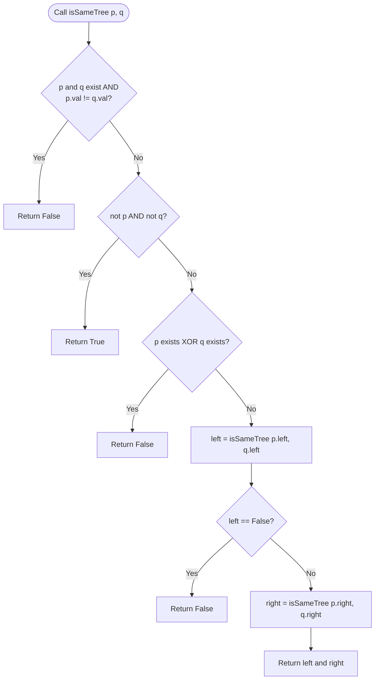

# Technical Documentation: Same Binary Tree (`submission-1.py`)

## File Information
- **File Path:** `Data Structures & Algorithms/same-binary-tree/submission-1.py`
- **Language:** Python

---

## Overview

The `submission-1.py` file provides a solution for determining whether two binary trees are identical. Two binary trees are considered identical if they are structurally identical and the nodes have the exact same values at corresponding positions.

The implementation defines a `Solution` class containing a recursive method, `isSameTree`, which traverses both trees simultaneously to perform value and structural comparisons.

---

## Data Structures & Dependencies

### `TreeNode` (Commented Definition)
The code includes a commented-out definition for the `TreeNode` class representing a single node in a binary tree:

```python
# class TreeNode:
#     def __init__(self, val=0, left=None, right=None):
#         self.val = val
#         self.left = left
#         self.right = right
```

- **`val`**: Integer value stored in the node (default: `0`).
- **`left`**: Pointer/reference to the left child node (default: `None`).
- **`right`**: Pointer/reference to the right child node (default: `None`).

---

## Class & Method Summary

### `Solution` Class

#### `isSameTree(p: Optional[TreeNode], q: Optional[TreeNode]) -> bool`

Determines if two binary tree root nodes `p` and `q` represent identical binary trees.

##### Parameters
- `p` (`Optional[TreeNode]`): The root node of the first binary tree (or `None`).
- `q` (`Optional[TreeNode]`): The root node of the second binary tree (or `None`).

##### Returns
- `bool`: Returns `True` if both binary trees are identical in structure and node values; otherwise, returns `False`.

---

## Execution & Logic Flow

The function uses a depth-first traversal with explicit recursive calls on the left and right subtrees.



### Step-by-Step Breakdown

1. **Value Mismatch Check:**
   ```python
   if p and q and p.val != q.val:
       return False
   ```
   Checks if both nodes exist (`p` and `q` are not `None`) but their values are different. If so, the trees are not identical, and the function immediately returns `False`.

2. **Base Case - Both Nodes Null:**
   ```python
   if not p and not q:
       return True
   ```
   If both nodes are `None` (reaching the end of matching branches), this subtree comparison is valid, returning `True`.

3. **Structural Mismatch Check:**
   ```python
   if p and not q or q and not p:
       return False
   ```
   If one node exists while the other is `None`, the trees differ in structure, returning `False`.

4. **Recursive Left Subtree Evaluation:**
   ```python
   left = self.isSameTree(p.left, q.left)
   if left == False:
       return False
   ```
   The method recursively calls `isSameTree` on the left child nodes (`p.left` and `q.left`). If this recursive check evaluates to `False`, the method short-circuits and immediately returns `False`.

5. **Recursive Right Subtree Evaluation:**
   ```python
   right = self.isSameTree(p.right, q.right)
   ```
   If the left subtrees match, the method recursively calls `isSameTree` on the right child nodes (`p.right` and `q.right`).

6. **Final Result:**
   ```python
   return left and right
   ```
   Combines the boolean evaluation of the left and right recursive comparisons and returns the result.

---

## Complexity Analysis

- **Time Complexity:** $\mathcal{O}(N)$, where $N$ is the total number of nodes in the smaller tree. In the worst-case scenario where the trees are identical or differ at the last node, every node up to $N$ is visited once.
- **Space Complexity:** $\mathcal{O}(H)$, where $H$ is the height of the binary tree. This space is consumed by the implicit call stack due to recursion. In the worst case (a completely skewed tree), $H = N$. In a balanced tree, $H = \log(N)$.